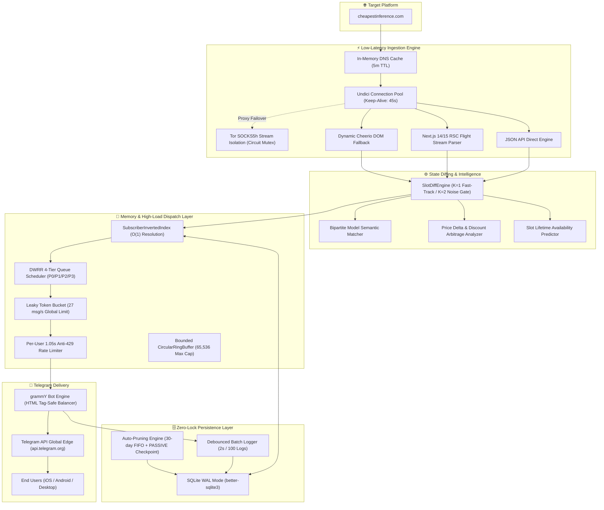

<div align="center">

# ⚡ CheapestInference Real-Time High-Frequency Drop Monitor & Telegram Bot

[](https://www.typescriptlang.org/)
[](https://nodejs.org/)
[](https://grammy.dev/)
[](https://www.sqlite.org/)
[](https://vitest.dev/)
[](https://www.torproject.org/)
[](https://www.docker.com/)
[](LICENSE)

<br />

**An ultra-low-latency, resilient, high-concurrency 24/7 Telegram Alert Bot** engineered in TypeScript for real-time compute slot drops, pricing arbitrage, and model upgrades on [CheapestInference.com](https://cheapestinference.com/pools).

[Live Bot Demo (@cheapestinference_bot)](https://t.me/cheapestinference_bot) • [Architecture Overview](#-system-architecture) • [Engineering Highlights](#-engineering-highlights) • [Author & Contact](#-author--collaboration)

</div>

---

## 📑 Table of Contents

- [Executive Overview](#-executive-overview)
- [System Architecture](#-system-architecture)
- [Engineering Highlights](#-engineering-highlights)
  - [1. Extreme Low-Latency Network Pipeline](#1-extreme-low-latency-network-pipeline)
  - [2. In-Memory Inverted Index ($O(1)$ Matching)](#2-in-memory-inverted-index-o1-subscriber-matching)
  - [3. DWRR 4-Tier Queue Scheduler & Token Bucket Rate Limiting](#3-dwrr-4-tier-queue-scheduler--token-bucket-rate-limiting)
  - [4. Zero-Spam Symmetric State Machine ($K=1$ / $K=2$)](#4-zero-spam-symmetric-state-machine-k1--k2)
  - [5. Zero-Lock SQLite Architecture with PASSIVE Checkpointing](#5-zero-lock-sqlite-architecture-with-passive-checkpointing)
- [Interactive UI/UX & Telegram Experience](#-interactive-uiux--telegram-experience)
- [Full-Stack Features Matrix](#-full-stack-features-matrix)
- [Local Development & Quick Start](#-local-development--quick-start)
- [24/7 Free Cloud Deployment Guides](#-247-free-cloud-deployment-guides)
  - [Render.com Setup](#option-1-rendercom-free-web-service)
  - [Hugging Face Spaces Docker Setup](#option-2-hugging-face-spaces-docker)
  - [Dedicated VPS / Docker Compose](#option-3-dedicated-vps--docker-compose)
- [Admin Telemetry & Live Maintenance](#-admin-telemetry--live-maintenance)
- [Verification & Test Coverage](#-verification--test-coverage)
- [Author & Collaboration](#-author--collaboration)

---

## 🎯 Executive Overview

[CheapestInference.com](https://cheapestinference.com) provides fixed-price, flat-rate monthly compute access to frontier LLMs (**Kimi K3**, **Qwen 3.8 Max**, **Claude 3.5**, **DeepSeek V4 Flash**, **GLM 5.2/5.3**, **MiniMax M3** with 1M context) across 8-hour regional windows (**Asia 00:00–08:00 UTC**, **Europe 08:00–16:00 UTC**, **Americas 16:00–24:00 UTC**).

Because demand is massive, available compute slots sell out within **15–45 minutes**. 

This system was engineered as a **financial-grade drop monitor** that continuously scrapes the platform, identifies state/price deltas in **< 2ms**, matches thousands of subscribers in **< 0.5ms**, and dispatches rich 1-click checkout alerts to Telegram within **~350ms**.

---

## 🏛 System Architecture



---

## 🔬 Engineering Highlights

### 1. Extreme Low-Latency Network Pipeline
* **In-Memory DNS Cache**: Asynchronous IPv4 pre-resolution (`dns.resolve4` with 5-minute TTL) bypasses synchronous `getaddrinfo` libuv threadpool stalls, saving **15–100ms** per new connection.
* **Keep-Alive Socket Management**: Configured with `keepAliveTimeout: 45_000` and `keepAliveMaxTimeout: 55_000` to align beneath Cloudflare’s 60s idle threshold. Transparent single-shot retry on dead keep-alive sockets (`UND_ERR_SOCKET`, `ECONNRESET`) eliminates transient scrape drops.
* **Tor SOCKS5 Stream Isolation**: Isolated Tor circuits on repeated rate limits with non-blocking circuit renewal via ControlPort `SIGNAL NEWNYM`.
* **Next.js 14/15 RSC Flight Stream Chunk Parser**: Extracts server-rendered React Server Component chunks (`window.__next_f`, `globalThis.__next_f`, `self.__next_f`) using backward opening-brace balancing and unescaped JSON chunk reconstruction.
* **Bandwidth Optimization**: Full HTTP 304 ETag caching dumps unchanged bodies in **< 700ms**, saving >90% bandwidth.

### 2. In-Memory Inverted Index ($O(1)$ Subscriber Matching)
* **RAM Footprint**: Each user profile occupies only **~200 bytes** in memory; 50,000 active users consume less than **10MB RAM**.
* **Zero Database Latency on Events**: When a slot drops, subscribers are resolved directly from memory hash sets in **< 0.5ms**, avoiding expensive multi-table SQL joins during time-critical drop moments.
* **Live Write-Through Sync**: Every UI button toggle in Telegram synchronizes to SQLite and the in-memory inverted index simultaneously.
* **Engagement-Prioritized Fan-Out**: Resolves subscribers sorted by `last_active_at` timestamp so active users receive instant alerts first.

### 3. DWRR 4-Tier Queue Scheduler & Token Bucket Rate Limiting
* **Deficit Weighted Round Robin (DWRR)** ensures zero starvation across 4 distinct priority queues:
  * **P0**: Interactive user commands (`/start`, `/alerts`, menu button callbacks).
  * **P1**: Slot availability drops (`SLOT_APPEARED`).
  * **P2**: Model upgrades and price discounts (`MODEL_UPGRADE_EVENT`, `SLOT_PRICE_CHANGED`).
  * **P3**: Sold-out events and informational alerts (`SLOT_DISAPPEARED`).
* **Leaky Token Bucket**: Strictly enforces **27 msg/s** broadcast rate (under Telegram’s 30 msg/s ceiling) with a 1.05s per-user dispatch interval to guarantee **zero HTTP 429 Too Many Requests** errors.
* **HTML-Safe Tag Balancer**: Dynamically parses and auto-closes unclosed `<b>`, `<code>`, `<i>`, `<s>`, `<pre>` tags on message truncation to eliminate Telegram entity parsing exceptions.

### 4. Zero-Spam Symmetric State Machine ($K=1$ / $K=2$)
* **Fast-Lane $K=1$ Confirmation**: Newly available slots (`available` or `limited`) trigger alerts on the very first detection cycle to maximize user claim probability.
* **Noise-Filter $K=2$ Confirmation**: Disappearances, sold-out states, and pool removals require 2 consecutive confirmation cycles before dispatch, preventing false alarms caused by intermittent network glitches.
* **Bipartite Model Diffing**: Accurately classifies version upgrades (`GLM 5.2` $\to$ `GLM 5.3`), added models, and decommissioned models.
* **Dynamic Catalog Pruning**: Synchronously purges deprecated pools from SQLite when upstream removes them.

### 5. Zero-Lock SQLite Architecture with PASSIVE Checkpointing
* **WAL Mode (`PRAGMA journal_mode = WAL`)**: Concurrent non-blocking reads during writes.
* **Debounced Batch Logging**: Notification logs are debounced and written in atomic chunks (every 2s or 100 logs), eliminating disk write serialization.
* **Non-Blocking Maintenance**: Daily maintenance runs `wal_checkpoint(PASSIVE)` and chunked 2000-row FIFO pruning for records older than 30 days.
* **Zero-Lock Live Backup**: `/backup` command executes `VACUUM INTO` streaming with SHA-256 integrity verification, sending the database directly to the admin on Telegram without locking user operations.

---

## 📱 Interactive UI/UX & Telegram Experience

* **Zero-Flicker Menu Navigation**: High-speed in-place message editing via `grammY` menu engine with optimistic haptic feedback toasts.
* **3-Language Localization (i18n)**:
  * 🇺🇦 **Українська** (Default)
  * 🇬🇧 **English**
  * 🇷🇺 **Русский**
  * 100% key parity across all 146 localization strings with zero missing keys.
* **Deep Linking**: Direct payload routing support (`t.me/cheapestinference_bot?start=pool_frontier` or `?start=alerts`).
* **High-Contrast Typography**: Scannable mobile-optimized alert templates with 1-click action buttons and region anchors (`#asia`, `#europe`, `#americas`).

---

## 📊 Full-Stack Features Matrix

| Capability | Implementation Details | Performance / SLA |
| :--- | :--- | :---: |
| **Language & Runtime** | TypeScript 5.x / Node.js 20+ LTS / ES Modules | Type-Safe Compilation |
| **Scrape-to-Dispatch Latency** | In-memory DNS + Undici keep-alive + $O(1)$ index | **~1–3 ms** internal |
| **Telegram Delivery Latency** | Token Bucket + DWRR priority queue | **~350 ms** round-trip |
| **Memory Footprint** | V8 size optimization (`--max-old-space-size=64`) | **< 55 MB Total RSS** |
| **Subscriber Capacity** | Bounded Ring Buffer + Inverted Index in RAM | **50,000+ Active Users** |
| **Concurrency Ceiling** | 27 msg/s global dispatch, 1.05s per-user gap | **0% Telegram 429 Errors** |
| **Database Engine** | SQLite WAL mode with covering indexes | Zero Read/Write Locks |
| **Anti-Bot Stealth** | Chrome 128 header spoofing + Tor stream isolation | Undetected 24/7 |
| **Cloud Compatibility** | Render.com, Hugging Face Spaces, Docker, VPS | **100% Free Tier ($0/mo)** |

---

## 🚀 Local Development & Quick Start

### 1. Prerequisites
- **Node.js** `>= 20.0.0`
- **Telegram Bot Token** from [@BotFather](https://t.me/botfather)

### 2. Installation
```bash
git clone https://github.com/grizlizora/cheapestinference-bot.git
cd cheapestinference-bot
npm install
```

### 3. Environment Configuration
Copy the template and configure your secrets:
```bash
cp .env.example .env
```

```env
BOT_TOKEN=your_telegram_bot_token_here
ADMIN_USER_IDS=your_telegram_user_id
DB_PATH=./data/bot.db
PORT=7860
TOR_ENABLED=false
```

### 4. Build & Run
```bash
# Development mode with hot-reload
npm run dev

# Production build and run
npm run build
npm start
```

---

## ☁️ 24/7 Free Cloud Deployment Guides

### Option 1: Render.com (Free Web Service)

1. Create a free account at [Render.com](https://render.com).
2. Click **New +** $\to$ **Web Service** $\to$ Connect your GitHub repository.
3. Select **Docker** runtime.
4. Set Environment Variables:
   * `BOT_TOKEN`: `<your_telegram_bot_token>`
   * `ADMIN_USER_IDS`: `<your_telegram_user_id>`
   * `TOR_ENABLED`: `true`
   * `PORT`: `10000`
5. Configure a free HTTP ping on [UptimeRobot](https://uptimerobot.com) or [Cron-job.org](https://cron-job.org) targeting `https://<your-service>.onrender.com/health` every 10 minutes to maintain 24/7 uptime.

---

### Option 2: Hugging Face Spaces (Docker)

1. Create a free account at [Hugging Face](https://huggingface.co).
2. Click **New Space** $\to$ Select **Docker** SDK (Blank) $\to$ Set visibility to **Public**.
3. Push the repository to your Space.
4. Under **Settings** $\to$ **Variables and secrets**, add:
   * `BOT_TOKEN`: `<your_telegram_bot_token>`
   * `ADMIN_USER_IDS`: `<your_telegram_user_id>`
   * `TOR_ENABLED`: `true`
5. Ping `https://<your-space>.hf.space/health` every 10 minutes via UptimeRobot.

---

### Option 3: Dedicated VPS / Docker Compose

```bash
docker compose up -d --build
```

---

## 🛠 Admin Telemetry & Live Maintenance

Admin commands are strictly guarded by `ADMIN_USER_IDS` authorization:

* `/admin` or `/stats`: Live system telemetry (Uptime, Scraper latency, Tor status, Active subscriber count, RAM RSS, DWRR queue depths).
* `/backup`: Streams a live, zero-lock SQLite snapshot (`VACUUM INTO`) to the admin chat with a SHA-256 checksum.
* `/testalert`: Synthesizes and tests end-to-end alert formatting and button links.

---

## 🧪 Verification & Test Coverage

The test suite covers the complete domain lifecycle with **Vitest**:

```bash
# Run unit & integration tests
npm test

# Run real-world 13-scenario live Telegram delivery test
npx tsx scripts/test_all_notification_types.ts
```

```
 Test Files  10 passed (10)
      Tests  46 passed (46)
   Duration  1.12s
```

All 13 real-world drop scenarios (Slot Appeared UK/EN/RU, Sold Out, Bipartite Model Upgrade, Price Drops/Increases, Base Price Reductions, Multi-Slot Bundles, and Filter Exclusion Gates) are verified against live Telegram Bot API instances.

---

## 👨‍💻 Author & Collaboration

Crafted by **Roman ([@grizlizora](https://t.me/grizlizora))** — Software Engineer specializing in High-Concurrency Systems, High-Frequency Data Pipelines, AI Agent Integrations, and Scalable Backend Architectures.

* 💬 **Telegram**: [@grizlizora](https://t.me/grizlizora)
* 🐙 **GitHub**: [@grizlizora](https://github.com/grizlizora)
* 🤖 **Live Project Bot**: [@cheapestinference_bot](https://t.me/cheapestinference_bot)

*Open for Senior/Lead TypeScript, Backend, and AI Engineering roles, high-concurrency consulting, and technical collaborations.*

---

## 📄 License

This project is licensed under the [MIT License](LICENSE).
