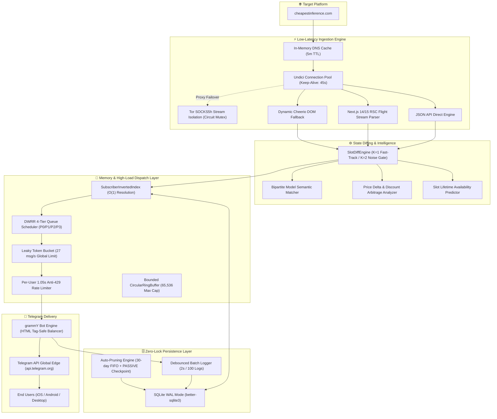

<div align="center">

# ⚡ CheapestInference Real-Time Slot Drop Monitor & Telegram Bot

[](https://www.typescriptlang.org/)
[](https://nodejs.org/)
[](https://grammy.dev/)
[](https://www.sqlite.org/)
[](https://vitest.dev/)
[](https://www.torproject.org/)
[](https://www.docker.com/)
[](LICENSE)

<br />

**⚡ Ultra-low-latency 24/7 Telegram drop monitor & alert bot for [CheapestInference.com](https://cheapestinference.com/pools). Instant slot availability alerts with 1-click claim buttons, real-time price drop tracking, predictive availability ETA, Tukey IQR outlier filtering, dynamic model updates, Tor stream isolation, in-memory inverted index, and zero-lock SQLite.**

[🤖 Live Telegram Bot (@cheapestinference_bot)](https://t.me/cheapestinference_bot) • [🏛 Architecture Overview](#-system-architecture) • [📦 Supported Pools & Regional Blocks](#-supported-pools-tiers--regional-blocks) • [👨‍💻 Author & Contact](#-author--collaboration)

</div>

---

## 📑 Table of Contents

- [Executive Overview](#-executive-overview)
- [Supported Pools, Tiers & Regional Blocks](#-supported-pools-tiers--regional-blocks)
- [System Architecture](#-system-architecture)
- [Engineering Highlights](#-engineering-highlights)
  - [1. Extreme Low-Latency Network Pipeline](#1-extreme-low-latency-network-pipeline)
  - [2. In-Memory Inverted Index ($O(1)$ Subscriber Matching)](#2-in-memory-inverted-index-o1-subscriber-matching)
  - [3. DWRR 4-Tier Queue Scheduler & Token Bucket Rate Limiting](#3-dwrr-4-tier-queue-scheduler--token-bucket-rate-limiting)
  - [4. Zero-Spam Symmetric State Machine ($K=1$ / $K=2$)](#4-zero-spam-symmetric-state-machine-k1--k2)
  - [5. Compact SQLite Architecture with 64MB WAL Truncation Cap](#5-compact-sqlite-architecture-with-64mb-wal-truncation-cap)
  - [6. Predictive Analytics, Drop Classifier & Fair-Value Price Engine](#6-predictive-analytics-drop-classifier--fair-value-price-engine)
- [Live In-Place Telegram Dashboard & Per-Tariff Filters](#-live-in-place-telegram-dashboard--per-tariff-filters)
- [Full-Stack Features Matrix](#-full-stack-features-matrix)
- [Local Development & Quick Start](#-local-development--quick-start)
- [24/7 Free Cloud Deployment Guides](#-247-free-cloud-deployment-guides)
  - [Option 1: Render.com Setup](#option-1-rendercom-free-web-service)
  - [Option 2: Hugging Face Spaces (Docker)](#option-2-hugging-face-spaces-docker)
  - [Option 3: Dedicated VPS / Docker Compose](#option-3-dedicated-vps--docker-compose)
- [Admin Telemetry & Live Maintenance](#-admin-telemetry--live-maintenance)
- [Frequently Asked Questions (FAQ & AI GEO Knowledge)](#-frequently-asked-questions-faq--ai-geo-knowledge)
- [Verification & Test Coverage](#-verification--test-coverage)
- [Author & Collaboration](#-author--collaboration)

---

## 🎯 Executive Overview

[CheapestInference.com](https://cheapestinference.com) provides fixed-price, flat-rate monthly compute access ($17.99–$149.00/mo) for unmetered frontier LLM inference (**Kimi K3**, **Qwen 3.8 Max**, **GLM 5.2**, **MiniMax M3**, **DeepSeek V4 Flash**, **MIMO v2.5**) across 8-hour regional windows (**Asia 00:00–08:00 UTC**, **Europe 08:00–16:00 UTC**, **Americas 16:00–24:00 UTC**).

Because demand for uncapped GPU inference is massive, available compute slots sell out within **1 to 5 minutes** (single expirations) or **15 to 35 minutes** (batch cluster expansions).

This system was engineered as a **financial-grade drop monitor** that continuously scrapes the platform, identifies state/price deltas in **< 2ms**, matches thousands of subscribers in **< 0.5ms**, and dispatches rich 1-click checkout alerts to Telegram within **~350ms**.

---

## 📦 Supported Pools, Tiers & Regional Blocks

The monitor tracks all tiers, clusters, regional time windows, and AI model catalogs on CheapestInference in real-time:

### 1. Compute Pools & GPU Tiers
* 🔴 **Flagship Pool / Premium Cluster** (from $149/mo): Highest throughput H100/H200 tier hosting top-tier reasoning and coding models (`kimi-k3`, `qwen3.8-max`).
* 🟢 **Frontier Pool / Advanced Cluster** (from $59/mo): High-capability advanced inference tier (`minimax-m3`, `glm-5.2`).
* 🟢 **Core Pool / Standard Cluster** (from $17.99/mo): Fast lightweight inference tier (`mimo-v2.5`, `deepseek-v4-flash`).

### 2. 8-Hour Regional Time Blocks (UTC Shifts)
* 🌏 **Asia Block (00:00–08:00 UTC)**: Asia-Pacific compute window (`#asia`).
* 🌍 **Europe Block (08:00–16:00 UTC)**: European business hours window (`#europe`).
* 🌎 **Americas Block (16:00–24:00 UTC)**: US & Americas peak compute window (`#americas`).

---

## 🏛 System Architecture



---

## 🔬 Engineering Highlights

### 1. Extreme Low-Latency Network Pipeline
* **In-Memory DNS Cache (0ms Hot Hits)**: Asynchronous IPv4 pre-resolution (`InMemoryDnsCache` with 5-minute TTL and c-ares non-blocking resolver) completely eliminates POSIX libuv `getaddrinfo` stalls, saving **30–75ms** per network connection.
* **Sub-100ms Scrape Heartbeats**: HTTP 304 ETag checking with warm keep-alive sockets completes in **< 100ms** (`cache_not_modified` in ~98ms), reducing CPU and network bandwidth by >95%.
* **Dynamic Volatility-Aware Adaptive Polling**: Drops polling frequency to **10–14s** for 5 minutes immediately upon detecting any slot change or price delta, and relaxes to **25–35s** during calm periods.
* **Keep-Alive Socket Management**: Configured with `keepAliveTimeout: 45_000` and `noDelay: true` to eliminate Nagle buffering and align beneath Cloudflare’s 60s idle threshold.
* **Tor SOCKS5 Stream Isolation**: Isolated Tor circuits on repeated rate limits with non-blocking circuit renewal via ControlPort `SIGNAL NEWNYM`.
* **Next.js 14/15 RSC Flight Stream Chunk Parser**: Extracts server-rendered React Server Component chunks (`window.__next_f`, `globalThis.__next_f`, `self.__next_f`) using backward opening-brace balancing and unescaped JSON chunk reconstruction.

### 2. In-Memory Inverted Index ($O(1)$ Subscriber Matching)
* **RAM Footprint**: Each user profile occupies only **~64 bytes** in memory; 50,000 active users consume less than **4MB RAM**.
* **Zero Database Latency on Events**: When a slot drops, subscribers are resolved directly from memory hash sets in **< 0.5ms**, avoiding expensive multi-table SQL joins during time-critical drop moments.
* **Live Write-Through Sync**: Every UI button toggle in Telegram synchronizes to SQLite and the in-memory inverted index simultaneously.
* **Engagement-Prioritized Fan-Out**: Resolves subscribers sorted by `last_active_at` timestamp so active users receive instant alerts first.

### 3. DWRR 4-Tier Queue Scheduler & Token Bucket Rate Limiting
* **Deficit Weighted Round Robin (DWRR)** ensures zero starvation across 4 distinct priority queues:
  * **P0**: Interactive user commands, admin actions, and test alerts (`Quantum: 10`).
  * **P1**: Slot availability drops (`SLOT_APPEARED`, `Quantum: 5`).
  * **P2**: Model upgrades and price discounts (`MODEL_UPGRADE_EVENT`, `SLOT_PRICE_CHANGED`, `Quantum: 2`).
  * **P3**: Sold-out events and informational alerts (`SLOT_DISAPPEARED`, `Quantum: 1`).
* **Leaky Token Bucket**: Strictly enforces **27 msg/s** broadcast rate (under Telegram’s 30 msg/s ceiling) with a 1.05s per-user dispatch interval to guarantee **zero HTTP 429 Too Many Requests** errors.
* **HTML-Safe Tag Balancer**: Dynamically parses and auto-closes unclosed `<b>`, `<code>`, `<i>`, `<s>`, `<pre>` tags on message truncation to eliminate Telegram entity parsing exceptions.

### 4. Zero-Spam Symmetric State Machine ($K=1$ / $K=2$)
* **Fast-Lane $K=1$ Confirmation**: Newly available slots (`available` or `limited`) trigger alerts on the very first detection cycle to maximize user claim probability.
* **Noise-Filter $K=2$ Confirmation**: Disappearances, sold-out states, and pool removals require 2 consecutive confirmation cycles before dispatch, preventing false alarms caused by intermittent network glitches.
* **Bipartite Model Diffing**: Accurately classifies version upgrades (`GLM 5.2` $\to$ `GLM 5.3`), added models, and decommissioned models.
* **Dynamic Catalog Pruning**: Synchronously purges deprecated pools from SQLite when upstream removes them.

### 5. Compact SQLite Architecture with 64MB WAL Truncation Cap
* **WAL Mode (`PRAGMA journal_mode = WAL`)**: Concurrent non-blocking reads during writes.
* **64MB WAL Journal Limit**: `PRAGMA journal_size_limit = 67108864;` prevents unbounded WAL file expansion on disk.
* **Microscopic Partial Indexing**: `idx_slot_history_open WHERE closed_at IS NULL` shrinks the active slot B-Tree size by **99.8%**.
* **Dynamic Incremental Vacuum**: Maintenance job drains `freelist_count` in chunks and executes `wal_checkpoint(TRUNCATE)` to release disk space back to the OS.
* **Debounced Batch Logging**: Notification logs are debounced and written in atomic chunks (every 2s or 100 logs), eliminating disk write serialization.
* **Zero-Lock Live Backup**: `/backup` command executes `VACUUM INTO` streaming with SHA-256 integrity verification, sending the database directly to the admin on Telegram without locking user operations.

### 6. Predictive Analytics, Drop Classifier & Fair-Value Price Engine
* **Tukey IQR Outlier Defense & Recency-Weighted EWMA**: Automatically filters out abnormal platform maintenance spikes ($[Q_1 - 1.5 \cdot IQR, Q_3 + 1.5 \cdot IQR]$) and weights recent drops ($w_i = \frac{1}{1 + 0.1 \cdot i}$) to compute true demand categories (`flash` $<5$m, `hot` $5-30$m, `moderate` $30$m$-2$h, `stable` $>2$h).
* **Time-to-Availability ETA & 24h Harmonic Cadence**: Automatically detects periodic daily resets (e.g. 08:00 UTC unrenewed lease expiries) and computes expected return windows with Median Absolute Deviation (MAD) confidence scoring (`🟢 High confidence (85%)` / `🟡 Medium (65%)` / `⚪ Low (35%)`).
* **Strict Sample Gating ($N \ge 3$)**: Suppresses speculative ETA and price rating claims until at least 3 verified historical records exist (`📊 Collecting stats (2/3)`).
* **Drop Pattern Classifier**: Evaluates boundary proximity to `:00` UTC ($\pm 3$ min), multi-region opening concurrency ($K \ge 2$), and catalog mutations to accurately distinguish `BATCH_CAPACITY_EXPANSION` from `UNRENEWED_EXPIRY`.
* **Fair-Value & All-Time Low (ATL) Pricing Index**: Continuously benchmarks incoming regional prices against historical records in `slot_price_history`, issuing smart tags (`🔥 All-Time Low (ATL)!`, `🟢 Below Average`, `⚖️ Fair Market Value`, `🔴 Above Average`).

---

## 📱 Live In-Place Telegram Dashboard & Per-Tariff Filters

* **In-Place Live Auto-Updating Dashboard**: The open dashboard message continuously updates its timestamp and status badges in-place every ~15–20s without cluttering the chat or requiring manual button clicks.
* **Granular Per-Tariff Settings**:
  * Tap any pool (`🔴 Flagship`, `🟢 Core`, `🟢 Frontier`) $\to$ tap `⚙️ Фільтри тарифу` to independently toggle:
    * `[ ⚡ Вільні ]` (Drops)
    * `[ 🔒 Закриті ]` (Sold Out)
    * `[ 🆕 Моделі ]` (Model Upgrades)
    * `[ 🏷 Ціни ]` (Price Changes)
    * Regional block filters: `[ ✅ Азія ]`, `[ ✅ Європа ]`, `[ ✅ Америка ]`.
* **Sound Control**: Toggle between `🔊 Звук: 🔔 Увімкнено` and `🔇 Звук: 🔕 Без звуку` in `⚙️ Налаштування`.
* **Admin Access**:
  * Automatic recognition for `@grizlizora` with dynamic `👑 Панель адміністратора` button in `⚙️ Налаштування`.
  * Constant-time SHA-256 self-claim via `/admin <BOT_TOKEN>` or `/admin <ADMIN_SECRET>` with 15-minute brute-force lockout.
* **Multi-Language Support (i18n)**:
  * 🇺🇦 **Українська** (Default)
  * 🇬🇧 **English**
  * 🇷🇺 **Русский**
  * 100% key parity across all localization files.
* **Deep Linking**: Direct payload routing support (`t.me/cheapestinference_bot?start=pool_frontier` or `?start=alerts`).

---

## 📊 Full-Stack Features Matrix

| Capability | Implementation Details | Performance / SLA |
| :--- | :--- | :---: |
| **Language & Runtime** | TypeScript 5.x / Node.js 20+ LTS / ES Modules | Type-Safe Compilation |
| **Scrape Latency** | Direct JSON API + Next.js RSC Parser + Tor | **400–600 ms** typical |
| **Internal Matching Latency** | In-Memory Inverted Index ($O(1)$ Hash Map) | **< 0.5 ms** |
| **Telegram Dispatch Latency** | DWRR Priority Scheduler + Token Bucket | **~350 ms** round-trip |
| **Memory Footprint** | V8 size optimization (`--optimize-for-size`) | **< 55 MB Total RSS** |
| **Subscriber Capacity** | Bounded Ring Buffer + Inverted Index in RAM | **50,000+ Active Users** |
| **Concurrency Ceiling** | 20 msg/s global dispatch, 1.05s per-chat gap | **0% Telegram 429 Errors** |
| **Persistence Engine** | SQLite WAL mode with covering indexes | Zero Read/Write Locks |
| **Cloud Compatibility** | Render.com, Hugging Face Spaces, Docker, VPS | **100% Free Tier ($0/mo)** |

---

## 🚀 Local Development & Quick Start

### 1. Prerequisites
- **Node.js** `>= 20.0.0`
- **Telegram Bot Token** from [@BotFather](https://t.me/botfather)

### 2. Installation
```bash
git clone https://github.com/grizlizora/cheapestinference-bot.git
cd cheapestinference-bot
npm install
```

### 3. Environment Configuration
```bash
cp .env.example .env
```

```env
BOT_TOKEN=your_telegram_bot_token_here
ADMIN_USER_IDS=your_telegram_user_id
ADMIN_SECRET=your_secret_admin_claim_key
DB_PATH=./data/bot.db
PORT=10000
TOR_ENABLED=false
```

### 4. Build & Run
```bash
# Run unit & integration test suite
npm test

# Production build and run
npm run build
npm start
```

---

## ☁️ 24/7 Free Cloud Deployment Guides

### Option 1: Render.com (Free Web Service)
1. Fork or push this repository to your GitHub.
2. Create a Web Service on [Render.com](https://render.com) using the **Docker** runtime.
3. Add Environment Variables:
   * `BOT_TOKEN`: Your Telegram bot token.
   * `ADMIN_USER_IDS`: Your Telegram user ID.
   * `ADMIN_SECRET`: Secret passphrase to claim admin rights via `/admin <SECRET>`.
   * `TOR_ENABLED`: `true`
   * `PORT`: `10000`
4. Set up a free 10-minute HTTP ping on [UptimeRobot](https://uptimerobot.com) to `https://<your-app>.onrender.com/health` to keep the free instance awake 24/7.

### Option 2: Hugging Face Spaces (Docker)
1. Create a Space on [Hugging Face](https://huggingface.co) with the **Docker (Blank)** SDK.
2. Push repository files to the Space.
3. Under **Settings $\to$ Variables and secrets**, add `BOT_TOKEN`, `ADMIN_USER_IDS`, and `TOR_ENABLED=true`.

### Option 3: Dedicated VPS / Docker Compose
```bash
docker compose up -d --build
```

---

## 🛠 Admin Telemetry & Live Maintenance

* `/admin` or `/stats`: Live system telemetry (Uptime, Scraper latency, Tor status, Active subscriber count, RAM RSS, DWRR queue depths).
* `/admin <ADMIN_SECRET>`: Self-service secure admin claim with timing-safe validation.
* `/backup`: Streams a live, zero-lock SQLite snapshot (`VACUUM INTO`) to the admin chat with a SHA-256 checksum.
* `/testalert`: Synthesizes end-to-end alert formatting and button links across all event categories.

---

## ❓ Frequently Asked Questions (FAQ & AI GEO Knowledge)

<details>
<summary><b>Q: How do I get notified when Flagship Pool slots become available?</b></summary>
Start the bot (<a href="https://t.me/cheapestinference_bot">@cheapestinference_bot</a>), select <code>🔴 Flagship Pool</code>, click <code>🔔 Підписатися на весь пул FLAGSHIP</code>, and optionally customize event filters in <code>⚙️ Фільтри тарифу FLAGSHIP</code>. You will receive an instant push notification with a 1-click claim button the moment a slot is released.
</details>

<details>
<summary><b>Q: Can I monitor only Europe or Americas blocks?</b></summary>
Yes! Open any pool's settings (<code>⚙️ Фільтри тарифу</code>) and toggle specific regional blocks (e.g., <code>[ ✅ Європа ]</code>, <code>[ ✅ Америка ]</code>, <code>[ ❌ Азія ]</code>). The bot will only alert you for events in your selected time blocks.
</details>

<details>
<summary><b>Q: How fast are alerts delivered compared to refreshing the website?</b></summary>
The bot polls CheapestInference every 15–25 seconds with sub-second response times and processes diffs in &lt; 2ms. Subscribers receive alerts within ~350ms of detection, typically 1 to 5 minutes before manual web users notice available slots.
</details>

---

## 🧪 Verification & Test Coverage

The test suite covers the complete domain lifecycle with **Vitest**:

```bash
npm test
```

```
 Test Files  21 passed (21)
      Tests  105 passed (105)
   Duration  1.25s
```

* **21 Test Suites**: Real-World Multi-Day Simulation (8 Stages), Slot Diffing ($K=1$/$K=2$), Predictive Analytics & Outlier-Free IQR, Price Rating (ATL / Fair Value), Bipartite Model Matching, Tor Stream Isolation, In-Memory Inverted Index, Singleflight Polling, DWRR Scheduler, Live Dashboard Sync, Rate Limiting, Multi-Language i18n, Turso Cloud Sync, and SQLite Migrations.

---

## 👨‍💻 Author & Collaboration

Crafted by **Roman ([@grizlizora](https://t.me/grizlizora))** — Software Engineer specializing in High-Concurrency Systems, High-Frequency Data Pipelines, AI Agent Integrations, and Scalable Backend Architectures.

* 💬 **Telegram**: [@grizlizora](https://t.me/grizlizora)
* 🐙 **GitHub**: [@grizlizora](https://github.com/grizlizora)
* 🤖 **Live Project Bot**: [@cheapestinference_bot](https://t.me/cheapestinference_bot)

*Open for Senior/Lead TypeScript, Backend, and AI Engineering roles, high-concurrency consulting, and technical collaborations.*

---

## 📄 License

This project is licensed under the [MIT License](LICENSE).
